# Jadiel Ernesto Giraldo Lizama

## Registro de los ejercicios

Los ejercicios deben estar bien resueltos y con los pasos explicados.

**Ubica los siguientes números complejos en el plano**

$19)-2 + 3i:$

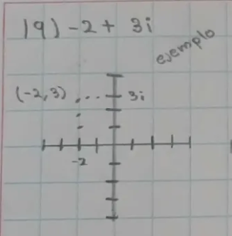

$20)1 - 2i:$

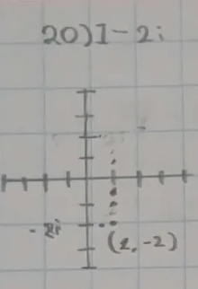

$21)-4 + 3i:$

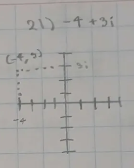

$22)3 + i:$

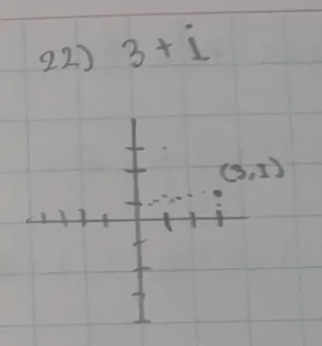

$23)-4 - 4i:$

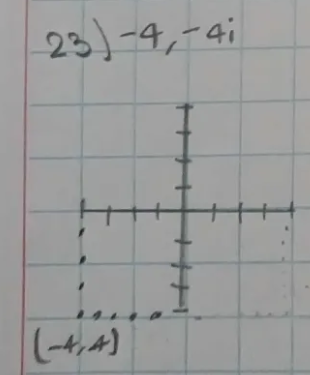

$24)-2 - i:$

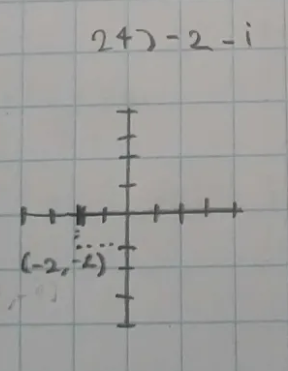

**Resuelve las siguientes operaciones con los números complejos**

$25)(-7 - 4i) - (2 + i)$

$$
\begin{array}{r|l}
-7 & -4i \\
-2 & -i \\
\hline
-9 & -5i
\end{array}
$$

$26)(2 - 4i) - (5 - 3i)$

$$
\begin{array}{r|l}
2 & -4i \\
-5 & 3i \\
\hline
-3 & -i
\end{array}
$$

$27)(7 - 8i) - (3i) - 7$

$$
\begin{array}{r|l}
7 & -8i \\
0 & -3i \\
-7 & 0i \\
\hline
0 & -11i
\end{array}
$$

$28)(1 + 5i) + (-8 - 5i) + 3$

$$
\begin{array}{r|l}
1 & 5i \\
-8 & -5i \\
3 & 0i \\
\hline
-4 & 0i
\end{array}
$$

$29)-8 - (3 - 5i) + (4 + 8i)$

$$
\begin{array}{r|l}
-8 & 0i \\
-3 & 5i \\
4 & 8i \\
\hline
-7 & 13i
\end{array}
$$

$30)(-4 + 2i) + (3i) + (-4 - 7i)$

$$
\begin{array}{r|l}
-4 & 2i \\
0 & 3i \\
-4 & -7i \\
\hline
-8 & -2i
\end{array}
$$

$31)(2i)(-4i)$

$$
\begin{array}{r|l}
0 & 2i \\
0 & -4i \\
\hline
0 & -2i
\end{array}
$$
$32)(-2i)(5i) \times 6$
$$
\begin{array}{r|l}
0 & 0i \\
60 & 0i \\
\hline
60 & 0i
\end{array}
$$

$33)(-7i)(8 + 8i)(-2 - 8i)$

$$
\begin{array}{l}
-7i \cdot 8 = -56i \\
-7i \cdot 8i = -56i^2 \rightarrow -56i - 56(-1) = -56i + 56 \rightarrow 56 + 56i
\end{array}
$$

$$
\begin{array}{l}
56 \cdot -2 = -112 \\
56 \cdot -8i = -448i \\
56i \cdot -2 = -112i \\
56i \cdot -8i = -448i^2 \rightarrow +448(-1)
\end{array}
\qquad
\begin{array}{l}
-112 - 448i - 112i + 448 \\
\downarrow \\
-112 - 112i - 448i + 448 \\
\downarrow \\
\begin{array}{r|l}
-154 & 132i \\
96 & 112i \\
\hline
-560 & -336i
\end{array} \rightarrow -560 - 336i
\end{array}
$$

$34)(-2 - 4i)(-1 - 6i)(7 - 6i)$

$$
\begin{array}{l}
-2 \cdot -1 = 2 \\
-2 \cdot -6i = 12i \\
-4i \cdot -1 = 4i \\
-4i \cdot -6i = 24i^2
\end{array}
$$

$$
2 + 12i + 4i + 24i^2 \rightarrow 2 + 16i - 24 \rightarrow -22 + 16i
$$

$$
\begin{array}{l}
-22 \cdot 7 = -154 \\
-22 \cdot -6i = 132i \\
16i \cdot 7 = 112i \\
16i \cdot -6i = -96i^2
\end{array}
\qquad
\begin{array}{l}
-154 + 132i + 112i - 96i^2 \\
\downarrow \\
-154 + 132i + 112i + 96 \\
\downarrow \\
\begin{array}{r|l}
-154 & 132i \\
96 & 112i \\
\hline
-58 & 244i
\end{array} \rightarrow -58 + 244i
\end{array}
$$

$35)(3i)(1 - 7i)(7 + 4i)$

$$
\begin{array}{l}
3i \cdot 1 = 3i \\
3i \cdot -7i = -21i^2 \rightarrow 3i + 21
\end{array}
\qquad
\begin{array}{l}
3i \cdot 7 = 21i \\
3i \cdot 4i = 12i^2 \\
21 \cdot 7 = 147 \\
21 \cdot 4i = 84i
\end{array}
\qquad
\begin{array}{l}
147 + 84i + 21i + 12i^2 \\
\downarrow \\
147 + 84i + 21i - 12 \\
\downarrow \\
\begin{array}{r|l}
147 & 84i \\
-12 & 21i \\
\hline
135 & 105i
\end{array} \rightarrow 135 + 105i
\end{array}
$$

$36)  (-6i)(-5 + i)(6 - 2i):$

$$
\begin{array}{l}
-6i \cdot -5 = 30i \\
-6i \cdot i = -6i^2 \rightarrow 30i + 6
\end{array}
\qquad
\begin{array}{l}
6 \cdot 6 = 36 \\
6 \cdot -2i = -12i \\
30i \cdot 6 = 180i \\
30i \cdot -2i = -60i^2
\end{array}
\qquad
\begin{array}{l}
36 - 12i + 180i + 60 \\
\downarrow \\
\begin{array}{r|l}
36 & -12i \\
60 & 180i \\
\hline
96 & 168i
\end{array} \rightarrow 96 + 168i
\end{array}
$$

$37)\frac{10 - 7i}{1 + 3i}:$
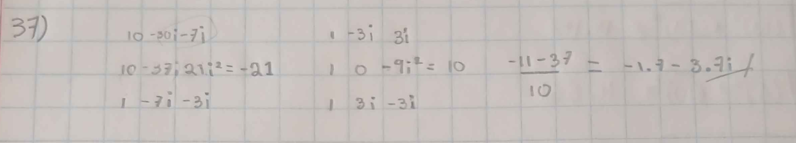

$38)\frac{4 + 2i}{-1 - 10i}:$
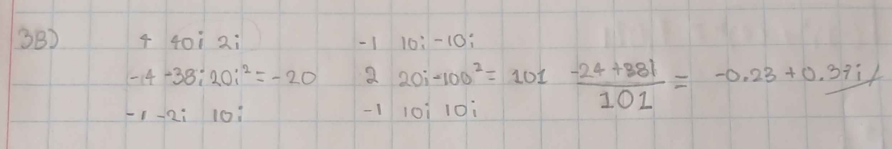

$39)\frac{1 + 4i}{-1 - 6i}:$
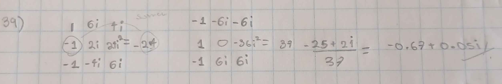

$40)\frac{-8 + 4i}{1 + i}:$
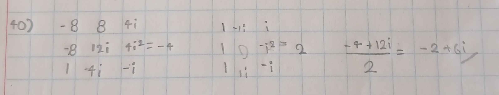

$41)\frac{-10 + 8i}{6 + i}:$
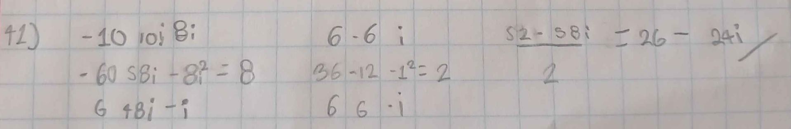

$42)\frac{2 - 2i}{4 - 10i}:$

**Calcula el valor absoluto de los siguientes números complejo**

$43)|-9 - 9i|:$

$$
\begin{array}{l}
\sqrt{(-9)^2 + (-9i)^2}=12.727 \\
\end{array}
$$

$44)|8 - 6i|:$

$$
\begin{array}{l}
\sqrt{(8)^2 + (-6i)^2}=10 \\
\end{array}
$$

$45)|6 - 3i|:$

$$
\begin{array}{l}
\sqrt{(6)^2 + (-3i)^2}=6.768\\
\end{array}
$$

$46)|10 + 10i|:$

$$
\begin{array}{l}
\sqrt{(10)^2 + (10i)^2}=14.142 \\
\end{array}
$$

$47)|6 - 10i|:$

$$
\begin{array}{l}
\sqrt{(6)^2 + (-10i)^2}=11.661 \\
\end{array}
$$

$48)|-1 + 7i|:$

$$
\begin{array}{l}
\sqrt{(-1)^2 + (7i)^2}=7.071 \\
\end{array}
$$

**Resuelve las siguiente potencias de i**
$49)i^5:$
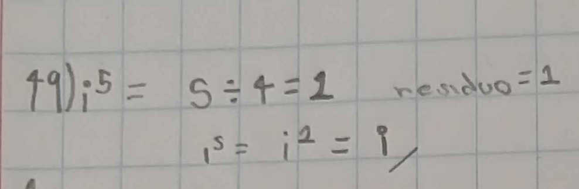

$50)i^{10}:$
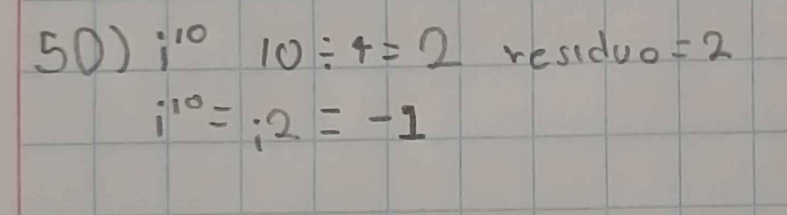

$51)i^{20}:$
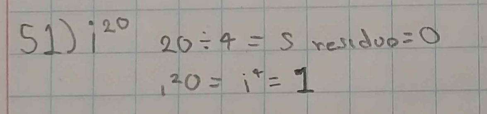

$52)i^{35}:$

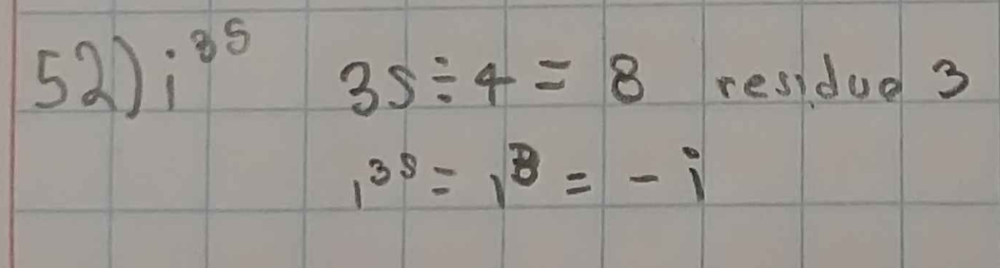

$53)i^{256}:$

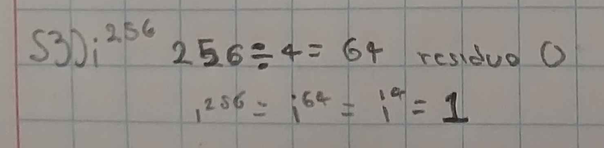

$54)i^{5^5}:$

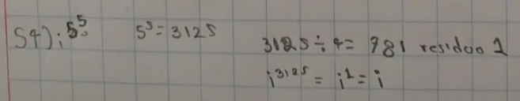

**Convierte los siguientes números complejos a su forma polar**

$55)6 - 8i:$

$$
 \sqrt{6^2 + (-8)^2} =  10
$$
$$
\theta = \tan^-1\left(\frac{-8}{6}\right) \approx -53.13^\circ + 360^\circ = 306.87^\circ
$$
$$
10(\cos 306.87^\circ + i\sin 306.87^\circ)
$$

$56)5\sqrt{2} + 5\sqrt{2}\cdot i:$

$$
\sqrt{(5\sqrt{2})^2 + (5\sqrt{2})^2} = 10
$$
$$
\theta = \tan^{-1}\left(\frac{5\sqrt{2}}{5\sqrt{2}}\right) = 45^\circ
$$
$$
10(\cos 45^\circ + i\sin 45^\circ)
$$

$57)2 - 2\sqrt{3}\cdot i:$

$$
\sqrt{2^2 + (-2\sqrt{3})^2} = 4
$$
$$
\theta = \tan^{-1}\left(\frac{-2\sqrt{3}}{2}\right) = -60^\circ + 360^\circ = 300^\circ
$$
$$
4(\cos 300^\circ + i\sin 300^\circ)
$$

$58)\frac{3\sqrt{3}}{2} - \frac{3i}{2}:$

$$
\sqrt{\left(\frac{3\sqrt{3}}{2}\right)^2 + \left(-\frac{3}{2}\right)^2} = 3
$$
$$
\theta = \tan^{-1}\left(\frac{-3/2}{3\sqrt{3}/2}\right) = -30^\circ + 360^\circ = 330^\circ
$$
$$
3(\cos 330^\circ + i\sin 330^\circ)
$$

$59)-2:$

$$
\sqrt{(-2)^2 + 0^2} = 2
$$
$$
\theta = 180^\circ
$$
$$
2(\cos 180^\circ + i\sin 180^\circ)
$$

$60)-7i:$

$$
\sqrt{0^2 + (-7)^2} = 7
$$
$$
\theta = 270^\circ
$$
$$
7(\cos 270^\circ + i\sin 270^\circ)
$$

**Convierte los números complejos de su forma polar a su forma rectangular**

$61)\cos 30^\circ + i \sin 30^\circ:$

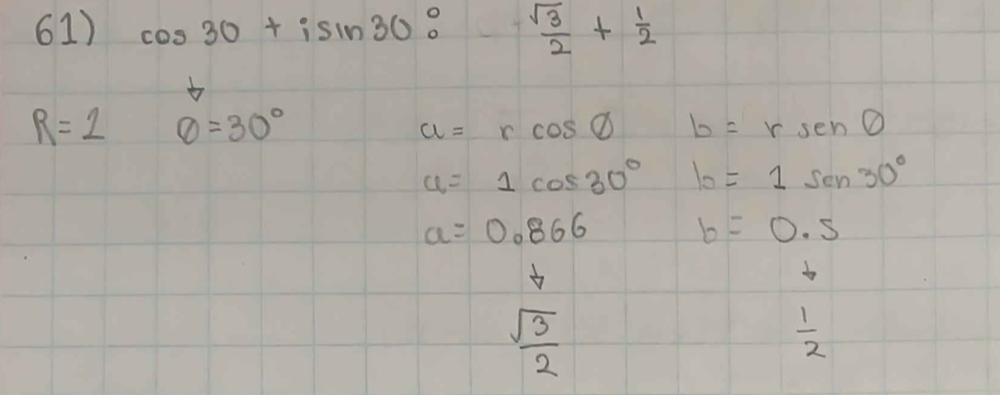

$62)2(\cos 60^\circ + i \sin 60^\circ):$

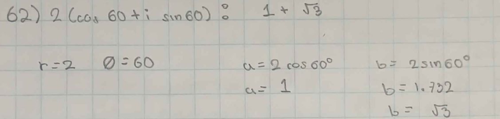

$63)1.5(\cos 90^\circ + i \sin 90^\circ):$

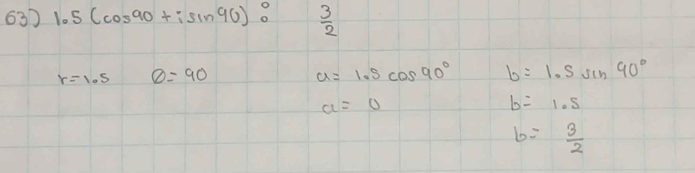

$64)2.5(\cos 120^\circ + i \sin 120^\circ):$

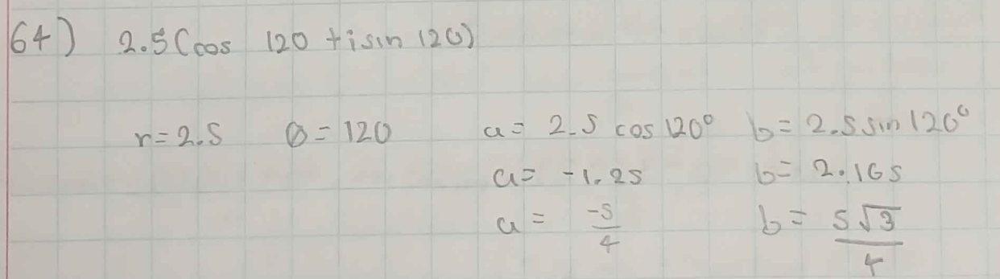

$65)4(\cos 135^\circ + i \sin 135^\circ):$

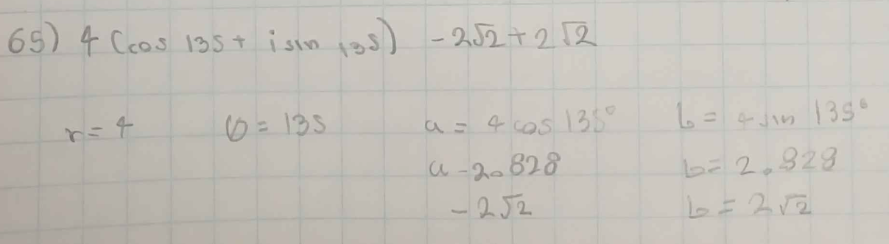

$66)3(\cos 180^\circ + i \sin 180^\circ):$

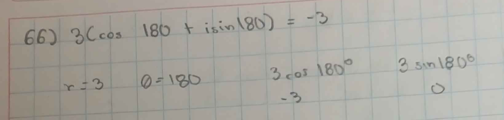

**Obtén TODAS las raices de los siguientes complejos**

$67)2\text{ raíces cuadradas de } 4(\cos 30^\circ + i \sin 30^\circ):$

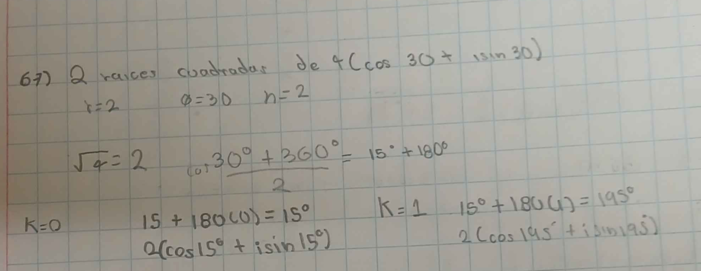

$68)2\text{ raíces cuadradas de } 3(\cos 90^\circ + i \sin 90^\circ):$

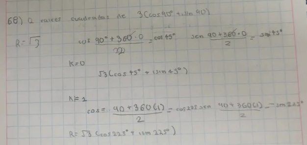

$69)3\text{ raíces cúbicas de } -4\sqrt{2} + 4i\sqrt{2}:$

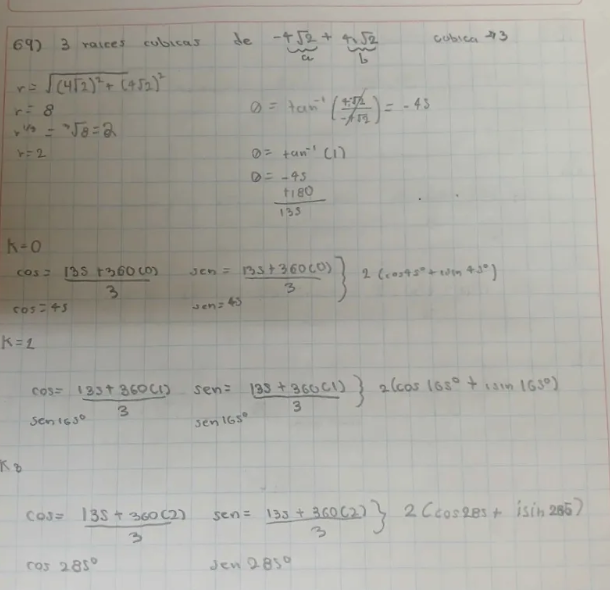

$70)3\text{ raíces cúbicas de } -\frac{27}{8}:$

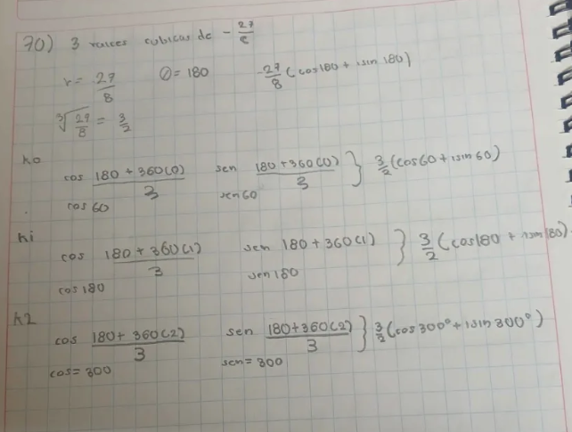

$71)5\text{ raíces de } -32i:$

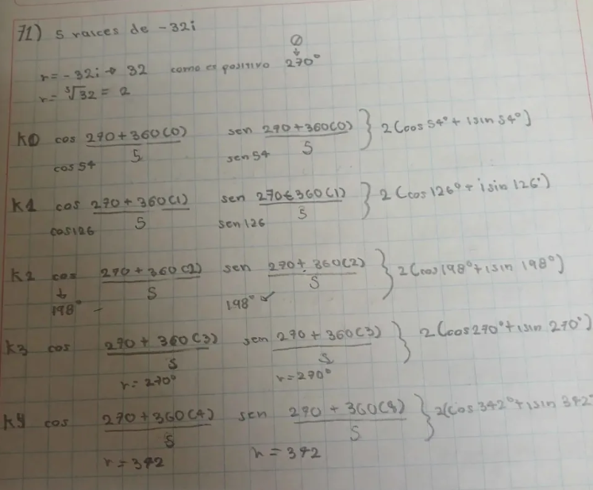

$72)6\text{ raíces de } 729:$

